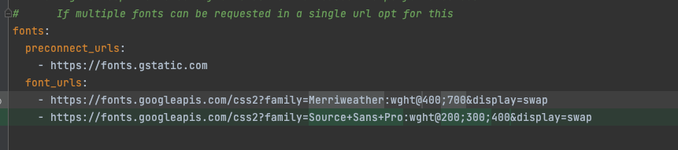
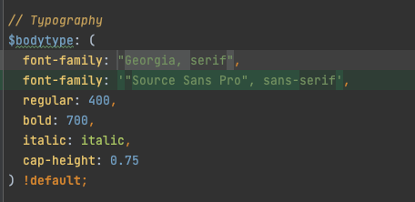

# [비상사태 기술 블로그](https://visangfel.github.io/)

## 블로그 소개
안녕하세요. 에듀테크 컴퍼니 소속 비상사태의 기술 블로그입니다.  

더 많은 이들에게 교육의 기회를 제공하자는 회사의 이념을 확장하여,  
"개발자들이 함께 성장할 수 있는 개발 문화" 를 만들고자 매일 노력합니다.

## 문서 소개
본 문서는 Jekyll(정적페이지 생성 툴) 환경설정 & 블로그 포스팅 작성을 안내합니다. 

## 목차
* 로컬에서 실행
    * 프로젝트 clone
    * jekyll 설치
    * 프로젝트 실행
* 포스팅 작성법
* 블로그 환경 설정 방법
  * font 수정
* 기타
    * 블로그 생성 도구 
    * 블로그 테마 
  
## 로컬에서 실행
### 1. 프로젝트 clone
`$ git clone https://github.com/visangfel/visangfel.github.io.git` 

### 2. Jekyll 설치
`$ gem install jekyll`

### 3. 프로젝트 실행
3.1 `$ cd visangfel.github.io.git` (프로젝트 내부로 이동)  
3.2 `$ bundle install` (패키지 설치)  
3.3 `$ jekyll serve` (서버 실행)  
3.4 브라우저에서 [http://127.0.0.1:4000/](http://127.0.0.1:4000/) 접속시 블로그 화면 정상 출력 확인  
** 이후에는 `jekyll serve` 명령어로 서버를 로컬에서 띄우면 됩니다. 

## 포스팅 작성법
포스팅은 마크다운 문법으로 작성합니다.

## 블로그 환경 설정 방법
### font 수정
- _config.xml 내 fonts 수정  
    
- _sass/_settings.scss 내 $bodytype, $headingtype 수정

## 기타
###  블로그 생성 도구
본 블로그는 [Jekyll](https://jekyllrb.com/) 과 [GitHub Pages](https://pages.github.com/) 기반으로 동작합니다. 

### 블로그 테마
[Alembic](https://github.com/daviddarnes/alembic/)